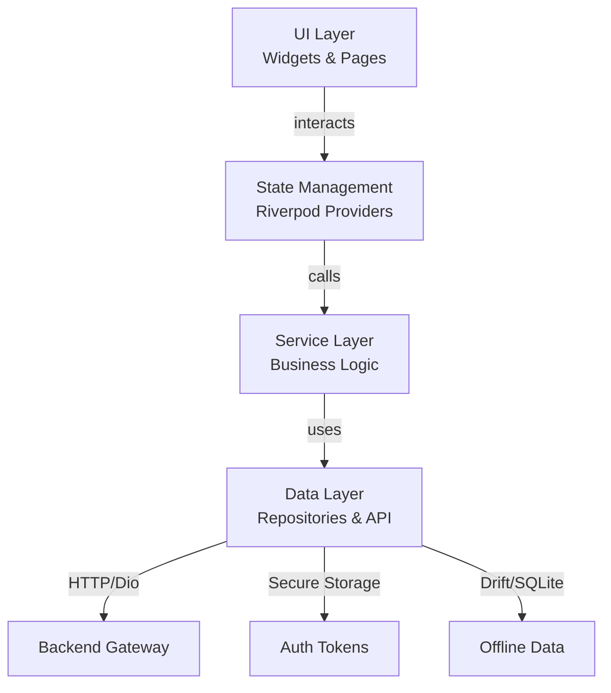

# 🌸 Torii Nihongo Mobile App

Mobile application cho nền tảng học tiếng Nhật Torii, tích hợp **WebRTC Live Classes**, **AI Feedback**, và **Spaced Repetition System**.

## 🏗 Architecture

Dự án áp dụng kiến trúc **Feature-based + Riverpod State Management**, chia tách rõ ràng giữa UI, Business Logic và Data Layer.



### Key Modules:
*   **Auth:** Secure Authentication (JWT, Refresh Token Rotation, Secure Storage).
*   **Dashboard:** Personalized learning overview.
*   **Live Class:** WebRTC streaming (LiveKit integration).
*   **Course:** Video lessons & curriculum tracking.
*   **Flashcards:** SRS algorithm for vocabulary learning.

---

## 🛠 Tech Stack

*   **Framework:** Flutter `^3.10.4`
*   **State Management:** Riverpod `^2.x`
*   **Routing:** GoRouter
*   **Networking:** Dio + Interceptors (Auto Refresh Token)
*   **Local DB:** Drift (SQLite)
*   **Secure Storage:** FlutterSecureStorage (Keychain/Keystore)
*   **Logging:** Pretty Dio Logger

---

## 🚀 Local Development Setup

### 1. Prerequisites
*   Flutter SDK installed.
*   Android Studio / VS Code configured.
*   Backend Server running at `localhost:8080`.

### 2. Installation
```bash
# Clone repo
git clone <repo_url>
cd torri-mobile

# Install dependencies
flutter pub get

# Generate code (Drift, Riverpod, JsonSerializable...)
dart run build_runner build --delete-conflicting-outputs
```

### 3. Database Migration
Nếu thay đổi schema DB (`lib/data/database/`), cần chạy lại lệnh generate code ở trên.

### 4. Run App
```bash
# Run on emulator/device
flutter run

# Note: Base URL for Android Emulator is usually http://10.0.2.2:8080
# Configurable in lib/core/config/app_config.dart
```

---

## Proto (Meet protocol)
Proto được đồng bộ từ `torii-monorepo/packages/protocol/proto` để gen code Dart dùng cho Meet (NATS, LiveKit, auth).

```bash
# 1. Đồng bộ toàn bộ .proto từ monorepo (wajlc_*, livekit_*, buf/, logger/)
./scripts/sync_proto_from_monorepo.sh

# 2. Gen code Dart (cần protoc + protoc_plugin 22.5.0)
./scripts/generate_proto.sh
```

Nếu repo monorepo không nằm cạnh torii-mobile, set biến môi trường:
`TORII_MONOREPO_PROTO_DIR=/đường/dẫn/tới/torii-monorepo/packages/protocol/proto`

---

## 🔐 Authentication Config
*   **Transport:** JSON Body (via `x-platform: mobile` header).
*   **Storage:** 
    *   `access_token` & `refresh_token` -> **Secure Storage**.
    *   `user_profile` -> **Drift Database**.
*   **Endpoints:** `/api/auth/login`, `/api/auth/refresh`.

---

**© 2026 Torii Nihongo Project**
